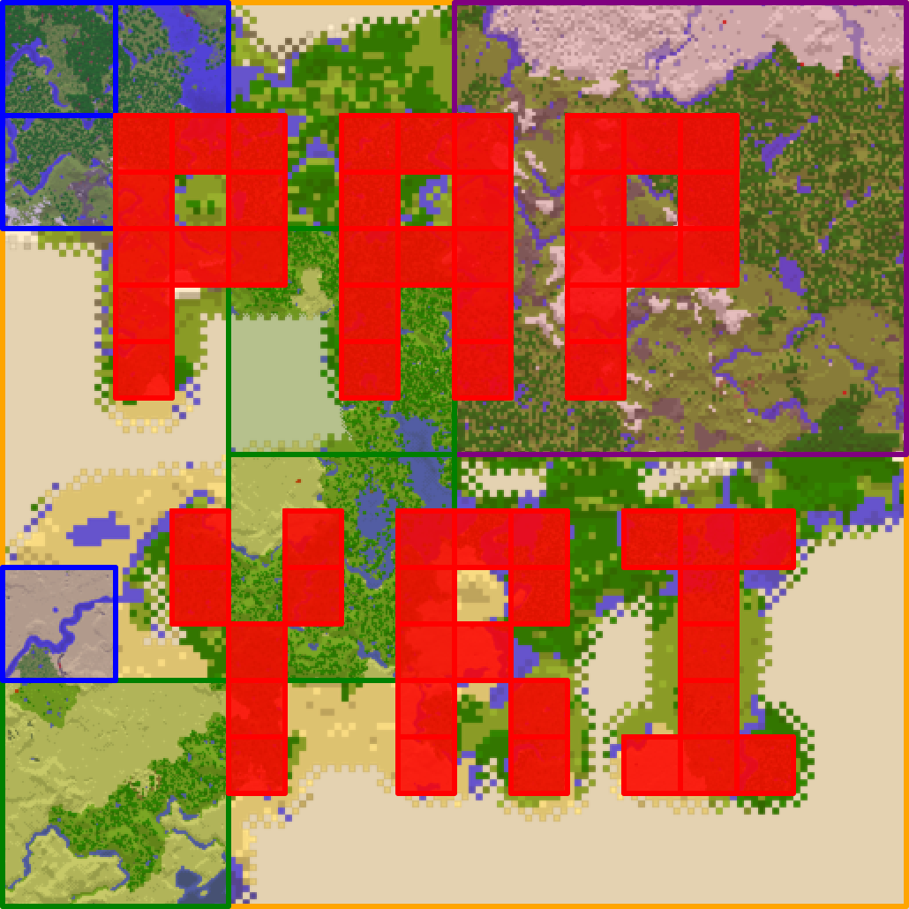

# papyri version 2.0

Papyri is a Minecraft map item web presenter. It will show all maps and banners created on a server positioned and scaled properly, creating a mosaic of your world as explored with maps. Since many maps can be created of the same area, Papyri will prioritize rendering so that maps with higher detail are rendered on top of maps of lower detail and maps at the same detail are rendered in order from oldest updated to newest updated.

[Example - Byblos](https://minecraft.greener.ca/byblos/)



## prerequisites

python3 and pip (pip3) (Not tested in python2)


some python stuff you'll need:

    pip3 install tqdm nbtlib Pillow

## usage

```
usage: papyri.py [-h] --world WORLD --type {java,bds}
                 [--includeunlimitedtracking] --output OUTPUT [--copytemplate]
                 [--debug]

convert minecraft maps to the web

optional arguments:
  -h, --help            show this help message and exit
  --world WORLD         location of your world folder or save folder
  --type {java,bds}     server type, bedrock or java
  --includeunlimitedtracking
                        include maps that have unlimited tracking on, this
                        includes older maps from previous Minecraft versions
                        and treasure maps in +1.13
  --output OUTPUT       output path for web stuff
  --copytemplate        copy default index.html and assets (do this if a new
                        release changes the tempalte)
  --debug               show debug logging
```

Once it's done, the contents of the output folder can be served as a website. It's completely static so it can be put in an S3 bucket a github project or hosted locally on your machine by running something like `python3 -m http.server` inside the output folder.


This project is licensed under the terms of the MIT license.
